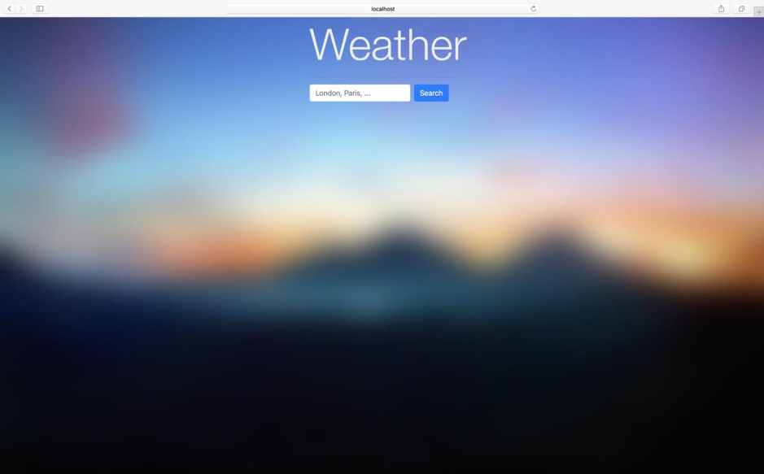

<h1>Weather Forecast</h1>

This is a weather forecast webpage, developed for one of the Web Development & Engineering (SWE363) course's assignments.

<b>The webpage uses the following APIs to obtain weather:</b>
<ul>
    <li>Google's Geocode API: to obtain the coordinates of a city passed by the user</li>
    <li>Dark Sky API: to obtain the weather information of the coordinates from a Geocode API response</li>
</ul>

<b>Screenshots:</b>

